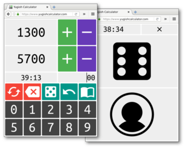

# Yugioh Calculator 2016



Check out the app at [www.yugiohcalculator.com](https://www.yugiohcalculator.com/)!

Welcome to the source code for the 2016 edition of Yugioh Calculator, a web app
for tracking life points in a game of Yu-Gi-Oh!

I've stripped down the set of features to only what is absolutely necessary, or
exceptionally useful, for dueling.  The hope is that Yugioh Calculator will
remain the simplest, most intuitive and most powerful calculator available.

Yugioh Calculator 2016 boasts the following features:

- Dual life point viewing and manipulation
- Ultra efficient quantity entry; only 2-3 clicks to modify either player's life
  by most amounts
- 1-click life points reset
- Dice, coins
- Undo
- History of life point modifications
- Match timer, 1-click to reset
- Warnings when match time is nearing end

The design has also been revamped to distribute space more economically, and to
be "flatter," and the colors are bolder.

## Development

Install Node.js (I recommend using mise; run `mise install`).

Then, run the following commands from the project root:

```js
npm i
npm start
```

The app will be available at [localhost:5173](http://localhost:5173).

Test that the code is still clean and working with `npm test`.

### Testing HTTPS-only features

Features like service workers only work with HTTPS.  You can easily test these
features by deploying a built version of the app to Vercel, which has HTTPS
enabled without any domain configuration necessary.

## Deployment

Have Vercel installed and be logged into Vercel.

```sh
npm i -g vercel
vercel login
```

Run `scripts/deploy.sh` to build and deploy the app to Vercel's preview environment.

If things look good in Vercel's preview environment, run it like
`./scripts/deploy.sh prod` to deploy to Vercel's production environment.

You may need to configure Vercel's "Build and Deployment" settings to get the
site to serve correctly:

- Framework Preset: `Other`
- Output Directory: `public`
- Other settings blank (not built by Vercel)

## Contributing

Ideas and pull requests are welcome.  Extreme minimalism is a goal.

Special thanks to [Caleb Evans](http://calebevans.me) for making the "Heads" and
"Tails" icons.

## License

GPL (see LICENSE.txt).  Happy hacking!
